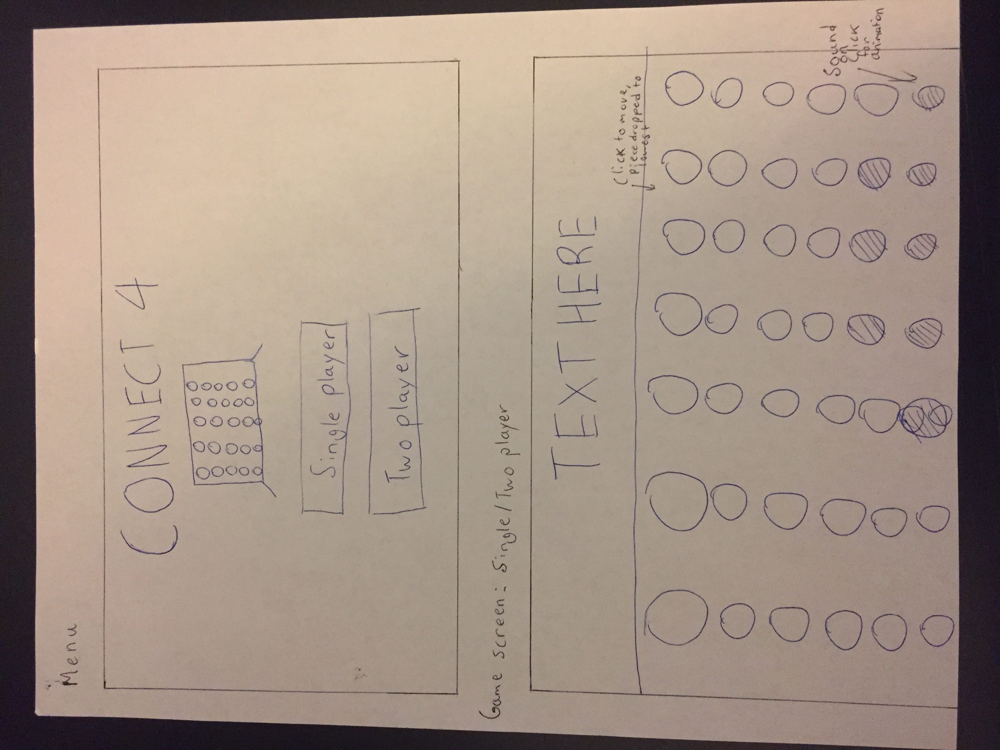

# Aditya's CPT: Connect 4

## Objective
The main goal of this game is to give a variety of audiences (single and two player mode) a simple, efficient/fast, and engaing
experience while playing the classic Connect  4.

## Instructions
The instructions of this game are fairly simple. The user simply needs to click on the row he/she wants his/her piece to drop, and it will
drop to the lowest available slot in the given row.

## Scoring
The game doesn't keep track of a score as there is really no score to Connect 4. After every click, it simply checks if there is a winner, and if there is one, announces it to stop the game. A winner is announced once a player has managed to put four of his/her pieces in a row, whether it be vertically, horizontally, or diagonally, so the winner is the player who achieves this goal first.

## Functionality and Limitations
I am proud of implementing a simple yet appealing user interface and menu screen to enhance the user's experience while playing my game.
Unforuntately, I was unable to implement an AI algorithm in the single player mode due to the extreme difficulty of it, as well as a lack of compatibility with the game. In the future, I would like to challenge myself implement a minimax decision tree AI algorithm when I find a compatible implementation method, which can add to the fun/challenge of the single player mode. 

## Screen Mock-Ups
Game Blueprint: 

