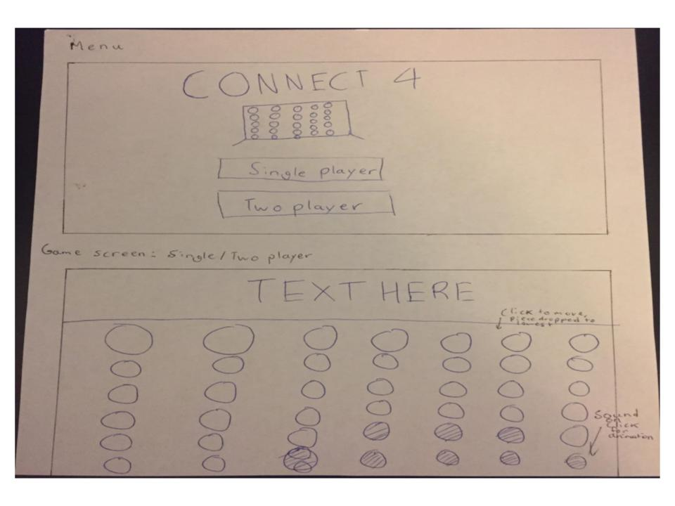

# Aditya's CPT: Connnect 4

## Objective
The main goal of this game is to give a variety of audiences (a single player or 2 players) a simple, efficient/fast, and engaing
experience while playing the classic Connect  4.

## Instructions
The instructions of this game are fairly simple. The user simply needs to click on the row he/she wants his/her piece to drop, and it will
drop to the lowest available slot in the given row.

## Scoring
The game doesn't keep track of a score as there is really no score to Connect 4. After every click, it simply checks if there is a winner, and if there is one, announces it to stop the game. A winner is announced once a player has managed to put four of his/her pieces in a row, whether it be vertically, horizontally, or diagonally, so the winner is the player who achieves this goal first.

## Screen Mock-Ups
Game Blueprint: 

